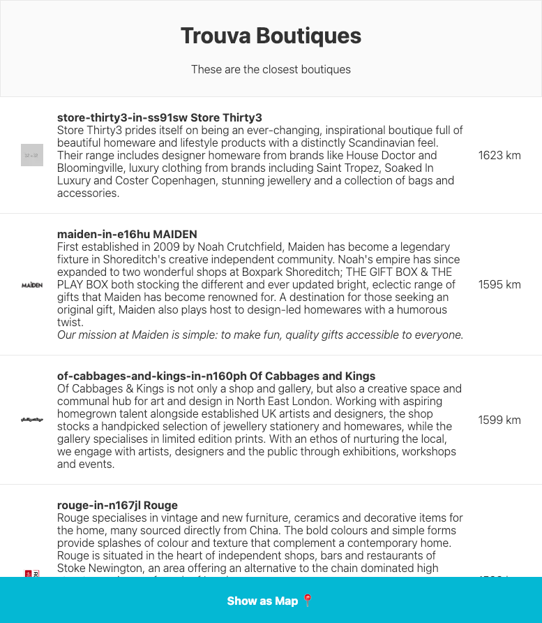
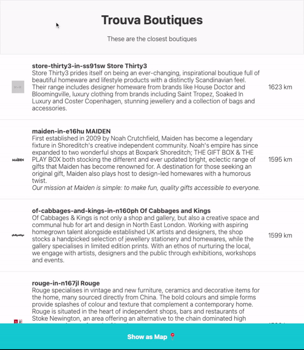
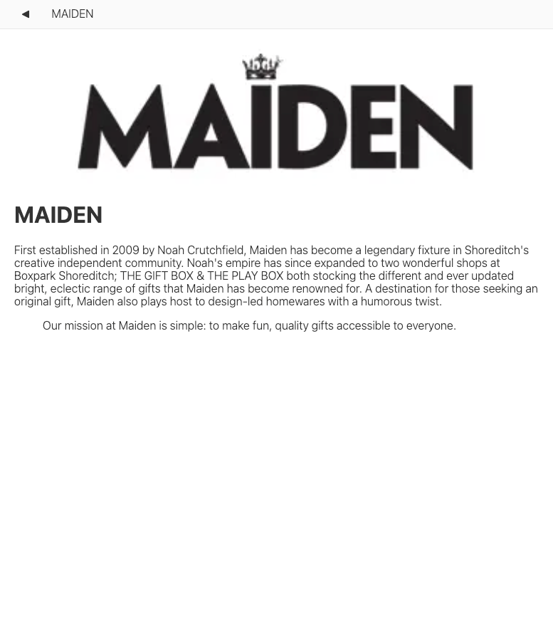
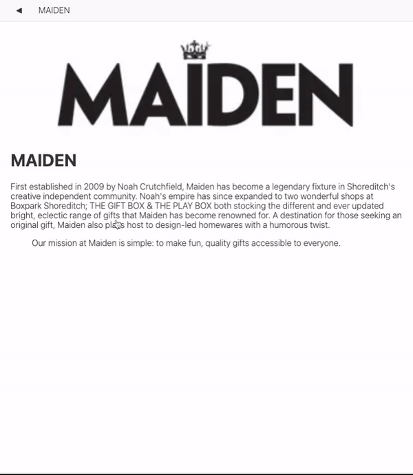
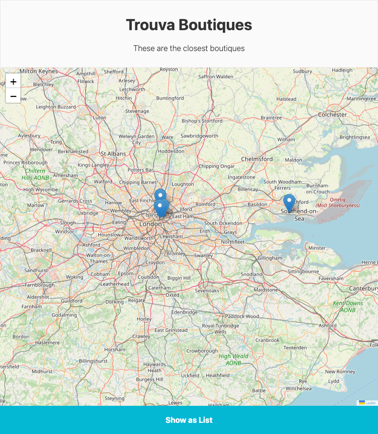

<h1 align="center">Trouva boutiques</h1>

<div align="center">


</div>

This project is a simple application made in React, its objective is to apply the best practices for the development of an application in React. The application displays the 5 closest boutiques.

## Preview

|  |  |
| ------------------------- | -------------------------------- |
|  |  |
|  |  |
|  |  |

## Installation

You need the [node](https://nodejs.org/en/download/) to run this project, this example was created for the version `v14.17.6`.

### Run application

### Dev

```bash
npm install
npm dev
```

#### Prod

```bash
npm install
npm build
npm start
```

## Folder structure

```
|___[_tests__] - Test files
|___components - UI components
|___contexts - Contexts and Providers of application
|___docs - Documentation and documentation assets
|___hooks - Functions hooks
|___layout - UI components that are displayed on all pages of the site
|___mock - Files used in testing
|___pages - Pages that reflect the browser address
    |___api - BFF to parse API requests
|___public - Static file serving
|___types - global interfaces/types to be used in all application
|___utils - Functions helpers
```

## Licença

The [MIT License]() (MIT)

Copyright :copyright: 2020
